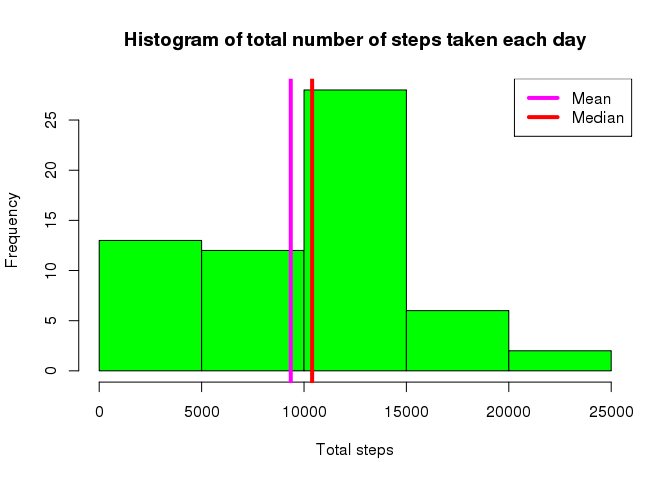

# Reproducible Research: Peer Assessment 1


## Loading and preprocessing the data
The original data is provided in a zipped file. To review the data first unzip the file (activity.zip) R and look at the data.

```r
# Check if file already exists, else unzip the file
if(!file.exists("activity.csv"))
    unzip(zipfile = "activity.zip")

# Read CSV file
activity_data <- read.csv(file = "activity.csv",na.strings = "NA", stringsAsFactors = FALSE )

# View the data
head(activity_data)
```

```
##   steps       date interval
## 1    NA 2012-10-01        0
## 2    NA 2012-10-01        5
## 3    NA 2012-10-01       10
## 4    NA 2012-10-01       15
## 5    NA 2012-10-01       20
## 6    NA 2012-10-01       25
```

```r
tail(activity_data)
```

```
##       steps       date interval
## 17563    NA 2012-11-30     2330
## 17564    NA 2012-11-30     2335
## 17565    NA 2012-11-30     2340
## 17566    NA 2012-11-30     2345
## 17567    NA 2012-11-30     2350
## 17568    NA 2012-11-30     2355
```


## What is mean total number of steps taken per day?

```r
# Use dplyr package
require(dplyr)

# Table of total steps per day
spd <- tbl_df(activity_data) %>% group_by(date) %>% summarize(s=sum(steps,na.rm = TRUE))

# Calc mean of total steps per day
spdm <- mean(spd$s)

# Calc median of total steps per day
spdmd <- median(spd$s)

# Create histogram
hist(spd$s, col="green", main="Histogram of total number of steps taken each day", xlab = "Total steps")

# Add mean
abline(v=spdm, col="magenta", lwd=4)

# Add median
abline(v=spdmd, lwd=4, col="red")

# Add legend
legend("topright", lwd=4, col=c("magenta", "red"), legend=c("Mean","Median"))
```

 

```r
# Mean
spdm
```

```
## [1] 9354.23
```

```r
# Median
spdmd
```

```
## [1] 10395
```


## What is the average daily activity pattern?


## Imputing missing values


## Are there differences in activity patterns between weekdays and weekends?
