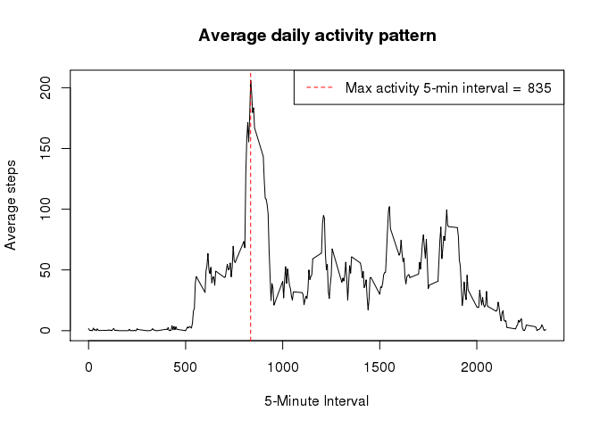
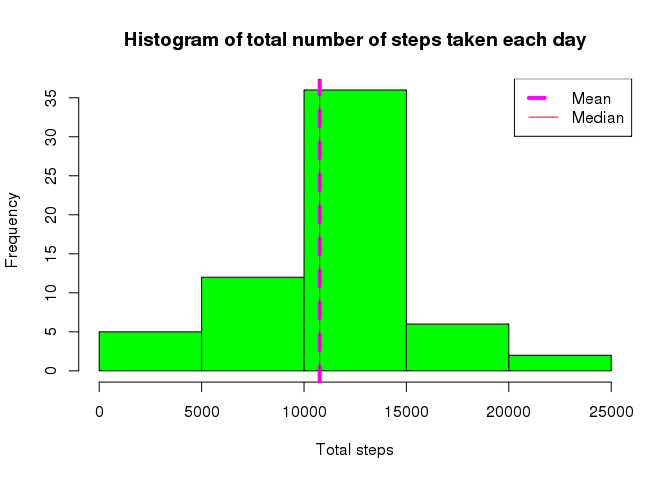

# Reproducible Research: Peer Assessment 1


## Loading and preprocessing the data
The original data is provided in a zipped file. To review the data first unzip the file (activity.zip) R and look at the data.

```r
# Check if file already exists, else unzip the file
if(!file.exists("activity.csv"))
    unzip(zipfile = "activity.zip")

# Read CSV file
activity_data <- read.csv(file = "activity.csv",na.strings = "NA", stringsAsFactors = FALSE )

# View the data
head(activity_data)
```

```
##   steps       date interval
## 1    NA 2012-10-01        0
## 2    NA 2012-10-01        5
## 3    NA 2012-10-01       10
## 4    NA 2012-10-01       15
## 5    NA 2012-10-01       20
## 6    NA 2012-10-01       25
```

```r
tail(activity_data)
```

```
##       steps       date interval
## 17563    NA 2012-11-30     2330
## 17564    NA 2012-11-30     2335
## 17565    NA 2012-11-30     2340
## 17566    NA 2012-11-30     2345
## 17567    NA 2012-11-30     2350
## 17568    NA 2012-11-30     2355
```


## What is mean total number of steps taken per day?

```r
# Use dplyr package
require(dplyr)

# Table of total steps per day
spd <- tbl_df(activity_data) %>% group_by(date) %>% summarize(s=sum(steps,na.rm = TRUE))

# Calc mean of total steps per day
spdm <- mean(spd$s)

# Calc median of total steps per day
spdmd <- median(spd$s)

# Create histogram
hist(spd$s, col="green", main="Histogram of total number of steps taken each day", xlab = "Total steps")

# Add mean
abline(v=spdm, col="magenta", lwd=4)

# Add median
abline(v=spdmd, lwd=4, col="red")

# Add legend
legend("topright", lwd=4, col=c("magenta", "red"), legend=c("Mean","Median"))
```

 

```r
# Mean
spdm
```

```
## [1] 9354.23
```

```r
# Median
spdmd
```

```
## [1] 10395
```

## What is the average daily activity pattern?

```r
# Prepare data by 5-min intervals
spi <- tbl_df(activity_data) %>% group_by(interval) %>% summarize(ave=mean(steps,na.rm = TRUE))

# Create plot
plot(x=spi$interval, y=spi$ave, type="l", xlab = "5-Minute Interval", ylab="Average steps", main="Average daily activity pattern")

# Order data for max average steps
spi <- spi[order(-spi$a),]

# Extract top row
max_spi <- spi[1,]

# Add top activity interval to plot
abline(v=max_spi$interval,b=max_spi$ave,lty=2, lwd=1, col="red")

# Add legend
legend("topright", lwd=1, lty=2, col=c("red"), legend=c(paste("Max activity 5-min interval = ", max_spi$interval)))
```

 

```r
# Print max 5-min interval
max_spi$interval
```

```
## [1] 835
```

## Imputing missing values
### Calculate number of NA rows.

```r
isNA  <- is.na(activity_data$steps)

# Number of missing values
length(isNA[isNA==TRUE])
```

```
## [1] 2304
```

### Create new copy of the activity data and update NA values with average 5 minute interval value

```r
activity_data2 <- tbl_df(activity_data)

# Replace NA values 
for( i in seq_len(nrow(activity_data2))) {
    if(is.na(activity_data2[i, 1])) {
        k <- as.integer(activity_data2[i,3])
        val <- spi[spi$interval==k,]$ave
        activity_data2[i, 1] <- val
    }
}
```
### Check number of NA rows after update, it should be 0.

```r
isNA  <- is.na(activity_data2$steps)

# Number of missing values
length(isNA[isNA==TRUE])
```

```
## [1] 0
```

### Run analysis on changes to the mean aend median

```r
# Table of total steps per day
spd2 <- group_by(activity_data2, date) %>% summarize(s=sum(steps,na.rm = TRUE))

# Calc mean of total steps per day
spdm2 <- mean(spd2$s)

# Calc median of total steps per day
spdmd2 <- median(spd2$s)

# Create histogram
hist(spd2$s, col="green", main="Histogram of total number of steps taken each day", xlab = "Total steps")

# Add mean
abline(v=spdm2, col="magenta", lwd=4, lty=2)

# Add median
abline(v=spdmd2, lwd=1, col="red")

# Add legend
legend("topright", lwd=c(4,1), lty=c(2,1), col=c("magenta", "red"), legend=c("Mean","Median"))
```

 

```r
# Mean
spdm2
```

```
## [1] 10766.19
```

```r
# Median
spdmd2
```

```
## [1] 10766.19
```
The mean and median are name same after applying the impute strategy. Both mean and median are larger to previous analysis when NA's were removed from the data set. 


## Are there differences in activity patterns between weekdays and weekends?
